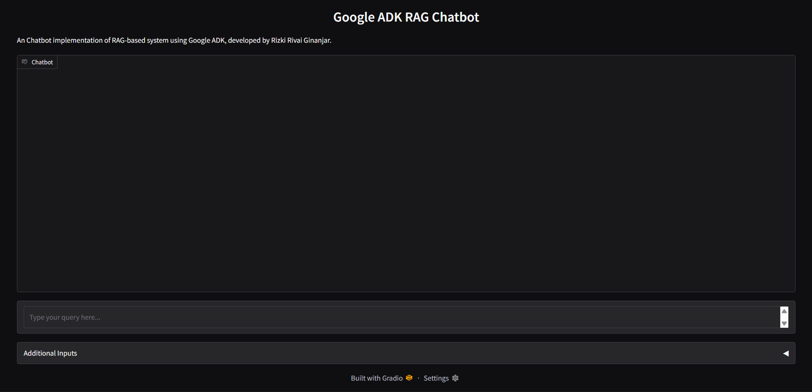
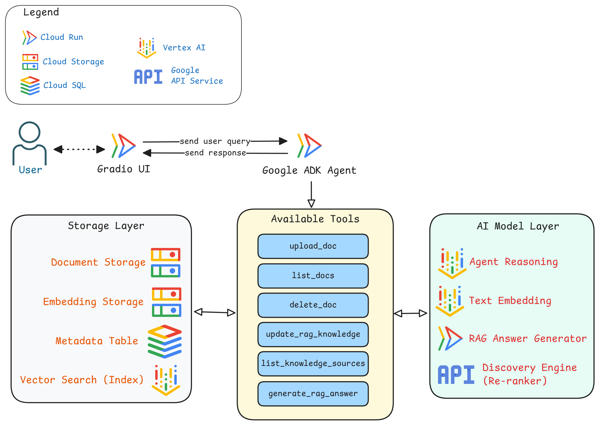
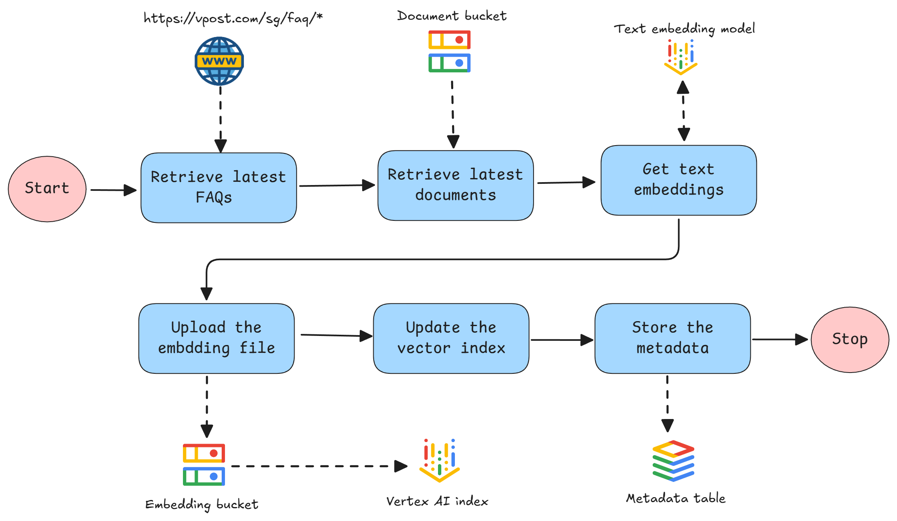
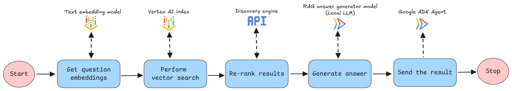

# 🧠 ADK-RAG-Chatbot

An **agentic RAG (Retrieval-Augmented Generation)** system built using **Google’s Agent Development Kit (ADK)**. This project integrates **LLM-powered reasoning** with **retrieval capabilities**, allowing the chatbot to respond with both intelligence and factual grounding from your knowledge base.

---

## 🧭 How to Use

1. Deploy all services (rag_chatbot, ui, and rag_model) using the `build_image.sh` and `deploy.sh` scripts.

2. Access the Gradio interface via the URL provided by the ui service.

3. To upload a file: Send a command/query to initiate the upload, then select your file by clicking the Additional Inputs box below the main text input.

4. Perform all other actions (document management, source listing, RAG updates, or question answering) by sending a clear natural language query (e.g., "delete document X" or "update the RAG knowledge base to the newest version!").

---

## 🧱 Architecture

This system is built using **Google ADK** as the core framework. It follows a **modular architecture** design to ensure flexibility, scalability, and seamless integration with other systems.

---

### 🖥️ UI and Agent

The **UI** is developed using the **Gradio** framework, while the **Agent** is implemented using **Google ADK**. Both components are hosted on separate cloud instances.

Users interact with the system through the Gradio UI by sending messages and optional file uploads to the Agent. The Agent then performs reasoning on the user’s query, decides which tools to execute, and processes the result before sending the response back to the user.

---

### 🧰 Tools

All tools are hosted on the same **Cloud Run** instance as the Agent.  
The following tools are currently available:

####  `upload_doc`

Uploads a document to the **GCP bucket** where other RAG knowledge base documents are stored.

####  `list_docs`

Lists all documents available in the **GCP bucket** that will be used to construct the RAG knowledge base.

####  `delete_doc`

Deletes a specified document from the document bucket.

####  `update_rag_knowledge`

This tool updates the **RAG knowledge base**, which uses **Vertex AI Index** for vector search.

The process begins by retrieving the latest **vPost FAQs** from the website (explained in more detail in the *Knowledge Base* section), along with any documents stored in the GCP bucket.  
All collected data is then parsed and chunked appropriately. The **Vertex AI Embedding Service** is used to generate text embeddings.

Next:
1. A JSON file containing embedding information is created.  
2. This file is uploaded to the **embedding bucket**.  
3. The **Vertex AI Vector Index** update process is triggered using this stored embedding file.  
4. Metadata (ID, text chunk, source) is stored in a **Cloud SQL** table for reference.

####  `list_knowledge_sources`

Lists all knowledge sources currently updated in the **Vertex AI Index**.  
Unlike `list_docs`, this includes both **web-based** and **document-based** sources.

####  `generate_rag_answer`

This tool generates answers to user queries by retrieving relevant contexts from the **RAG knowledge base**.

Process overview:
1. Generate an **embedding** for the user’s question.  
2. Perform **vector search** on the RAG knowledge base to find related contexts.  
3. **Rerank** the retrieved results and select the top relevant contexts.  
4. Send the **system prompt** (which defines answer-generation rules), the **user’s query**, and the **retrieved contexts** to the **LLM**.  
5. Return the **LLM-generated response** to the Agent.

---

## Knowledge base

There are two types of knowledge sources used in this project:
1. **From the vPost FAQ website** — [https://vpost.com/sg/faq](https://vpost.com/sg/faq)  
2. **From additional documents/files** — all stored inside the `relevant_docs` folder

Knowledge from the web source can be dynamically retrieved.  
However, for knowledge updates based on uploaded documents, there are specific rules depending on the file type:

1. **`.txt` files** — no limitations.  
2. **`.csv` files** — must follow the format example provided in the folder (`Copy of QnA doc (1).csv`).  
3. **`.pdf` files** — no major limitations, but currently only **text** and **table-based** content is processed. Visual or image-based information is **not** yet supported.

## Model used
1. **Agent reasoning model**: `Gemini 2.5 Flash` - Vertex AI
2. **Text embedding model**: `Gemini Embedding 001 (dimension 1536)` - Vertex AI 
3. **Re-ranker model**: `Semantic Ranker Fast 004` - Discovery Engine API
3. **RAG Answer Generator model**: `Semantic Ranker Fast 004` - Cloud Run-hosted model (vLLm, with gpu support)